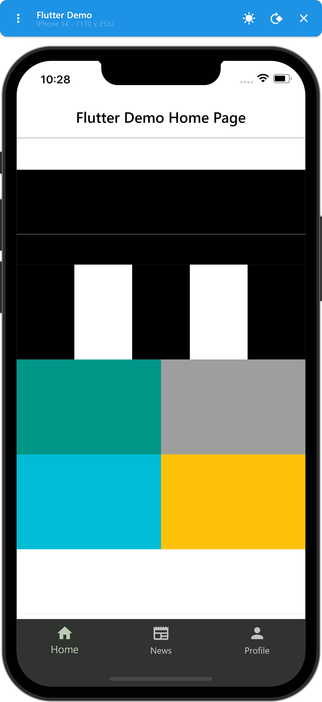
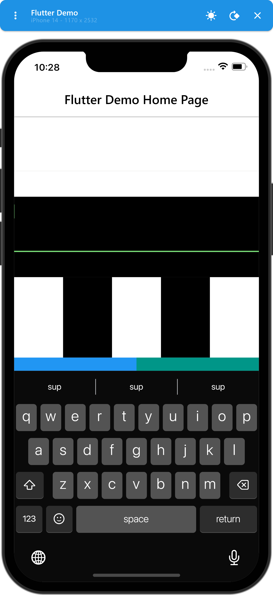

# flutter_simulator

# Deprecation notice

**This package has been deprecated and archived in favor of https://github.com/kekland/simulator. It's a complete rewrite of this project and offers way more features.**

**Warning: still highly experimental.**

<p align="center">
  
&nbsp; &nbsp; &nbsp; &nbsp;
  
</p>

https://github.com/kekland/flutter_simulator/blob/master/assets/demo.mov

## Features

- Support for emulating any kind of a device
- Rotating devices
- Emulating the software keyboard
- Brightness selector
- Quickly screenshotting the screen/frame

## TODO

- Improve documentation
- Improve iOS keyboard
- Emulating gestures (pinch, zoom, rotate)
- Improve `window_manager` to handle some cases when the window is resized
- Fix some antialiasing issues
- Add more devices
- Optimize rasterization performance (e.g. `screen_interceptor.dart`) - maybe add quality toggles?

## Devices

- iPhone 14

## Installation

This is still WIP, so I didn't publish it to Pub yet. Will do once it's more-less stable.

Add this package with a git reference to `pubspec.yaml`:

```yaml
flutter_simulator:
  git:
    url: https://github.com/kekland/flutter_simulator
    ref: f8368c5
```

Edit `main.dart` or create another entrypoint (something like `simulator.main.dart`), and tweak a couple of things:

- Instead of calling `WidgetsFlutterBinding.ensureInitialized()`, call `await SimulatorWidgetsBinding.ensureInitialized()`.
- Instead of calling `runApp(...)`, call `runFlutterSimulatorApp(...)`
- Doesn't work with `FlutterNativeSplash`. Remove any calls to `FlutterNativeSplash.preserve()` in the entrypoint. This might be fixed in the future, but due to the native splash package delaying the first frame paint, the stuff needed to initialize the simulator are never called.

## Credits

- https://github.com/leanflutter/window_manager
- https://github.com/alexmercerind/flutter_acrylic
- https://github.com/drogel/keyboard_attachable

iPhone Simulator:
- Apple
- https://useyourloaf.com/blog/iphone-14-screen-sizes/
- https://medium.com/@nathangitter/reverse-engineering-the-iphone-x-home-indicator-color-a4c112f84d34

Supporters:
- Azat Smet
- Dilmurat Yunussov
- Daniyar Zakarin

## Contact me

If you have any questions or suggestions feel free to open an issue or email me directly at `kk.erzhan@gmail.com`.
